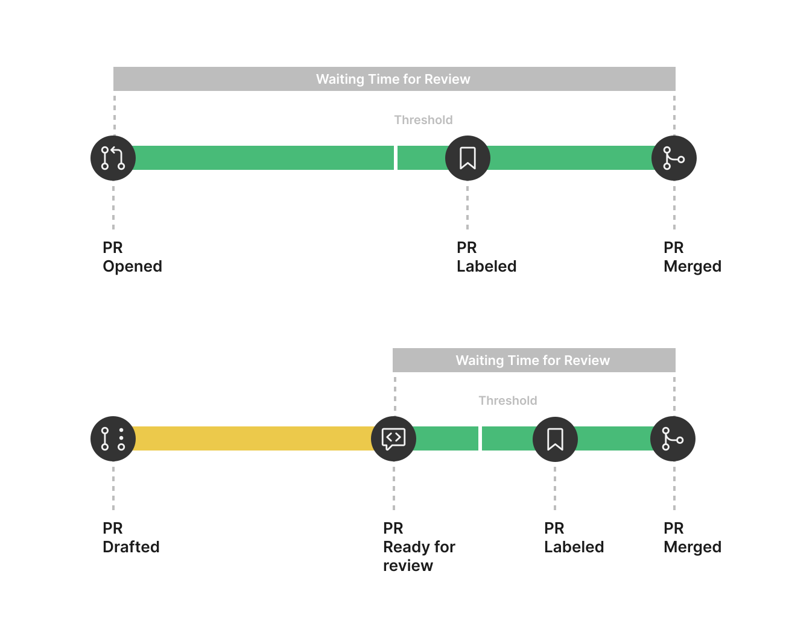

# Waiting For Review Labeler
An action for adding label to a pull request after it being opened or ready for review for more than certain hours.



## :arrow_forward: Usage

### Create workflow
Create the `waiting-for-review-labeler.yml` file in the `.github/workflows` directory.

```yml
name: Waiting For Review Labeler

on:
  schedule:
    # Crontab Every Hour
    - cron: '0 * * * *'

jobs:
  action:
    runs-on: ubuntu-latest
    steps:
      - uses: kentaro-m/waiting-for-review-labeler@main
        with:
          hours-before-label-add: 24
```

### Inputs
| Name | Description | Default |
| - | - | - |
| `repo-token` | Token for the repository. Can be passed in using `{{ secrets.GITHUB_TOKEN }}`. | N/A |
| `hours-before-label-add` | The number of hours to wait to add label to a pull request after it being opened or ready for review. | `24` |
| `label-name` | The name of label to add it to a pull request after it being opened or ready for review. | `waiting for review` |
| `skip-approved-pull-request` | Skip adding label when a pull request review status is approved. | `false` |

## :memo: Licence
MIT